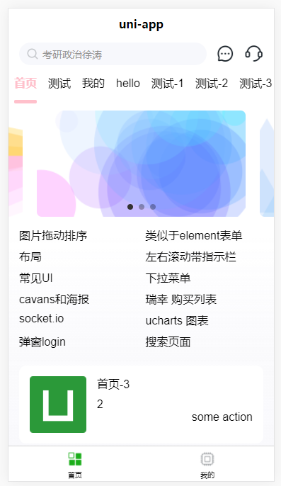

# uni-mcenter



## description

uni-mcenter 是一款自己学习搜集的 uniapp

## features

1. 皮肤功能 可以适配暗黑模式

## doc

1. doc
2. sassdoc
3. jsdoc

## Project setup
```
npm install
```

### Compiles and hot-reloads for development
```
npm run serve
```

### Compiles and minifies for production
```
npm run build
```
